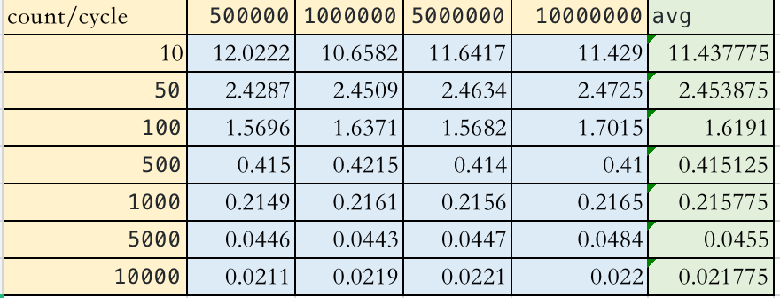
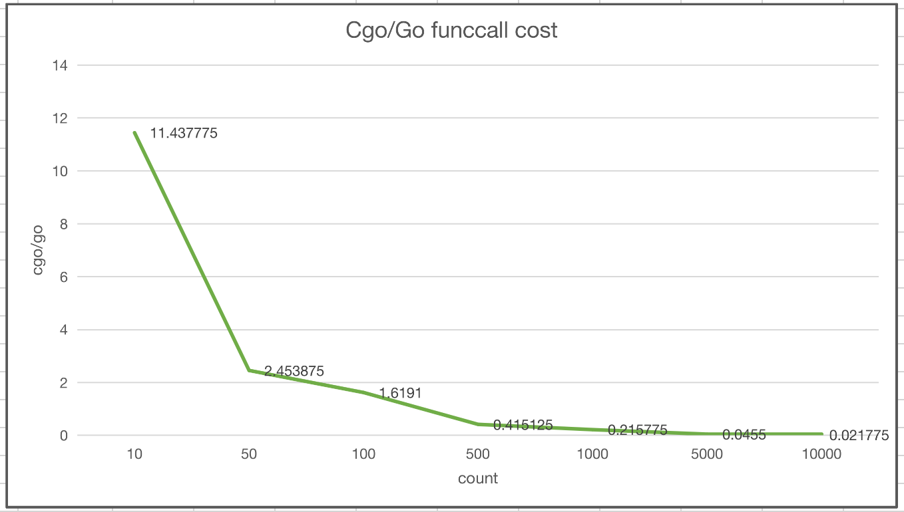

# cgo-bench

```
➜  calsum git:(main) ✗ go test . -v
=== RUN   TestCalsum
<nil>
cycle: 500000, pipe: 3.273452803s, pipe/cycle: 6.546µs
count: 10, cycle: 50000, cgo: 3.097909ms, go: 231.684µs, cgo/cycle: 61ns, go/cycle: 4ns, cgo/go: 13.3713 
count: 10, cycle: 100000, cgo: 6.984075ms, go: 472.823µs, cgo/cycle: 69ns, go/cycle: 4ns, cgo/go: 14.7710 
count: 10, cycle: 500000, cgo: 31.859756ms, go: 2.090415ms, cgo/cycle: 63ns, go/cycle: 4ns, cgo/go: 15.2409 
count: 10, cycle: 1000000, cgo: 60.798352ms, go: 5.366739ms, cgo/cycle: 60ns, go/cycle: 5ns, cgo/go: 11.3287 
count: 50, cycle: 50000, cgo: 3.128112ms, go: 760.302µs, cgo/cycle: 62ns, go/cycle: 15ns, cgo/go: 4.1143 
count: 50, cycle: 100000, cgo: 6.500613ms, go: 1.558554ms, cgo/cycle: 65ns, go/cycle: 15ns, cgo/go: 4.1709 
count: 50, cycle: 500000, cgo: 31.053234ms, go: 7.533252ms, cgo/cycle: 62ns, go/cycle: 15ns, cgo/go: 4.1222 
count: 50, cycle: 1000000, cgo: 60.515519ms, go: 14.483282ms, cgo/cycle: 60ns, go/cycle: 14ns, cgo/go: 4.1783 
count: 100, cycle: 50000, cgo: 2.985727ms, go: 1.586573ms, cgo/cycle: 59ns, go/cycle: 31ns, cgo/go: 1.8819 
count: 100, cycle: 100000, cgo: 6.18748ms, go: 3.127981ms, cgo/cycle: 61ns, go/cycle: 31ns, cgo/go: 1.9781 
count: 100, cycle: 500000, cgo: 30.76417ms, go: 15.601543ms, cgo/cycle: 61ns, go/cycle: 31ns, cgo/go: 1.9719 
count: 100, cycle: 1000000, cgo: 60.018155ms, go: 31.82072ms, cgo/cycle: 60ns, go/cycle: 31ns, cgo/go: 1.8861 
count: 500, cycle: 50000, cgo: 2.979872ms, go: 6.732664ms, cgo/cycle: 59ns, go/cycle: 134ns, cgo/go: 0.4426 
count: 500, cycle: 100000, cgo: 5.97159ms, go: 13.467624ms, cgo/cycle: 59ns, go/cycle: 134ns, cgo/go: 0.4434 
count: 500, cycle: 500000, cgo: 30.015274ms, go: 67.59636ms, cgo/cycle: 60ns, go/cycle: 135ns, cgo/go: 0.4440 
count: 500, cycle: 1000000, cgo: 59.213625ms, go: 132.779969ms, cgo/cycle: 59ns, go/cycle: 132ns, cgo/go: 0.4460 
count: 1000, cycle: 50000, cgo: 3.041828ms, go: 12.877788ms, cgo/cycle: 60ns, go/cycle: 257ns, cgo/go: 0.2362 
count: 1000, cycle: 100000, cgo: 6.674385ms, go: 26.503268ms, cgo/cycle: 66ns, go/cycle: 265ns, cgo/go: 0.2518 
count: 1000, cycle: 500000, cgo: 30.114849ms, go: 131.840245ms, cgo/cycle: 60ns, go/cycle: 263ns, cgo/go: 0.2284 
count: 1000, cycle: 1000000, cgo: 60.556479ms, go: 259.364363ms, cgo/cycle: 60ns, go/cycle: 259ns, cgo/go: 0.2335 
count: 5000, cycle: 50000, cgo: 3.00732ms, go: 65.328986ms, cgo/cycle: 60ns, go/cycle: 1.306µs, cgo/go: 0.0460 
count: 5000, cycle: 100000, cgo: 6.058649ms, go: 129.573303ms, cgo/cycle: 60ns, go/cycle: 1.295µs, cgo/go: 0.0468 
count: 5000, cycle: 500000, cgo: 30.000567ms, go: 641.227876ms, cgo/cycle: 60ns, go/cycle: 1.282µs, cgo/go: 0.0468 
count: 5000, cycle: 1000000, cgo: 66.00245ms, go: 1.3355065s, cgo/cycle: 66ns, go/cycle: 1.335µs, cgo/go: 0.0494 
count: 10000, cycle: 50000, cgo: 3.358476ms, go: 151.523996ms, cgo/cycle: 67ns, go/cycle: 3.03µs, cgo/go: 0.0222 
count: 10000, cycle: 100000, cgo: 6.895403ms, go: 270.522739ms, cgo/cycle: 68ns, go/cycle: 2.705µs, cgo/go: 0.0255 
count: 10000, cycle: 500000, cgo: 31.48742ms, go: 1.342653199s, cgo/cycle: 62ns, go/cycle: 2.685µs, cgo/go: 0.0235 
count: 10000, cycle: 1000000, cgo: 70.647279ms, go: 2.575400111s, cgo/cycle: 70ns, go/cycle: 2.575µs, cgo/go: 0.0274 
--- PASS: TestCalsum (11.24s)
PASS
ok      github.com/bingoohuang/cgo-bench/calsum 11.247s
```






use cgo CFLAGS: -O0 

```
➜  calsum git:(main) ✗ cc -O2 -o a.out calc_c/cal.c 
➜  calsum git:(main) ✗ go test . -v                
=== RUN   TestCalsum
<nil>
cycle: 500000, pipe: 608.725271ms, pipe/cycle: 1.217µs
count: 10, cycle: 50000, cgo: 3.161638ms, go: 217.354µs, cgo/cycle: 63ns, go/cycle: 4ns, cgo/go: 14.5460 
count: 10, cycle: 100000, cgo: 6.255581ms, go: 437.182µs, cgo/cycle: 62ns, go/cycle: 4ns, cgo/go: 14.3089 
count: 10, cycle: 500000, cgo: 31.219192ms, go: 1.962662ms, cgo/cycle: 62ns, go/cycle: 3ns, cgo/go: 15.9066 
count: 10, cycle: 1000000, cgo: 60.726394ms, go: 4.141099ms, cgo/cycle: 60ns, go/cycle: 4ns, cgo/go: 14.6643 
count: 50, cycle: 50000, cgo: 3.007071ms, go: 722.68µs, cgo/cycle: 60ns, go/cycle: 14ns, cgo/go: 4.1610 
count: 50, cycle: 100000, cgo: 5.991255ms, go: 1.445297ms, cgo/cycle: 59ns, go/cycle: 14ns, cgo/go: 4.1453 
count: 50, cycle: 500000, cgo: 30.261138ms, go: 7.231475ms, cgo/cycle: 60ns, go/cycle: 14ns, cgo/go: 4.1846 
count: 50, cycle: 1000000, cgo: 60.394144ms, go: 14.449242ms, cgo/cycle: 60ns, go/cycle: 14ns, cgo/go: 4.1797 
count: 100, cycle: 50000, cgo: 2.999314ms, go: 1.583207ms, cgo/cycle: 59ns, go/cycle: 31ns, cgo/go: 1.8945 
count: 100, cycle: 100000, cgo: 6.005363ms, go: 3.171264ms, cgo/cycle: 60ns, go/cycle: 31ns, cgo/go: 1.8937 
count: 100, cycle: 500000, cgo: 30.190425ms, go: 15.824035ms, cgo/cycle: 60ns, go/cycle: 31ns, cgo/go: 1.9079 
count: 100, cycle: 1000000, cgo: 60.205537ms, go: 31.420296ms, cgo/cycle: 60ns, go/cycle: 31ns, cgo/go: 1.9161 
count: 500, cycle: 50000, cgo: 2.98426ms, go: 6.569005ms, cgo/cycle: 59ns, go/cycle: 131ns, cgo/go: 0.4543 
count: 500, cycle: 100000, cgo: 6.110469ms, go: 14.095906ms, cgo/cycle: 61ns, go/cycle: 140ns, cgo/go: 0.4335 
count: 500, cycle: 500000, cgo: 30.632237ms, go: 67.274684ms, cgo/cycle: 61ns, go/cycle: 134ns, cgo/go: 0.4553 
count: 500, cycle: 1000000, cgo: 60.123124ms, go: 132.802009ms, cgo/cycle: 60ns, go/cycle: 132ns, cgo/go: 0.4527 
count: 1000, cycle: 50000, cgo: 3.135111ms, go: 12.972637ms, cgo/cycle: 62ns, go/cycle: 259ns, cgo/go: 0.2417 
count: 1000, cycle: 100000, cgo: 5.955276ms, go: 27.026888ms, cgo/cycle: 59ns, go/cycle: 270ns, cgo/go: 0.2203 
count: 1000, cycle: 500000, cgo: 30.116698ms, go: 130.575992ms, cgo/cycle: 60ns, go/cycle: 261ns, cgo/go: 0.2306 
count: 1000, cycle: 1000000, cgo: 59.794002ms, go: 259.544854ms, cgo/cycle: 59ns, go/cycle: 259ns, cgo/go: 0.2304 
count: 5000, cycle: 50000, cgo: 2.967818ms, go: 64.36186ms, cgo/cycle: 59ns, go/cycle: 1.287µs, cgo/go: 0.0461 
count: 5000, cycle: 100000, cgo: 6.030927ms, go: 129.345996ms, cgo/cycle: 60ns, go/cycle: 1.293µs, cgo/go: 0.0466 
count: 5000, cycle: 500000, cgo: 30.055289ms, go: 637.092527ms, cgo/cycle: 60ns, go/cycle: 1.274µs, cgo/go: 0.0472 
count: 5000, cycle: 1000000, cgo: 59.84662ms, go: 1.286180977s, cgo/cycle: 59ns, go/cycle: 1.286µs, cgo/go: 0.0465 
count: 10000, cycle: 50000, cgo: 2.98359ms, go: 128.419036ms, cgo/cycle: 59ns, go/cycle: 2.568µs, cgo/go: 0.0232 
count: 10000, cycle: 100000, cgo: 6.003882ms, go: 255.893442ms, cgo/cycle: 60ns, go/cycle: 2.558µs, cgo/go: 0.0235 
count: 10000, cycle: 500000, cgo: 30.428247ms, go: 1.276061948s, cgo/cycle: 60ns, go/cycle: 2.552µs, cgo/go: 0.0238 
count: 10000, cycle: 1000000, cgo: 60.17183ms, go: 2.686993062s, cgo/cycle: 60ns, go/cycle: 2.686µs, cgo/go: 0.0224 
--- PASS: TestCalsum (8.51s)
PASS
ok      github.com/bingoohuang/cgo-bench/calsum 8.511s
```
