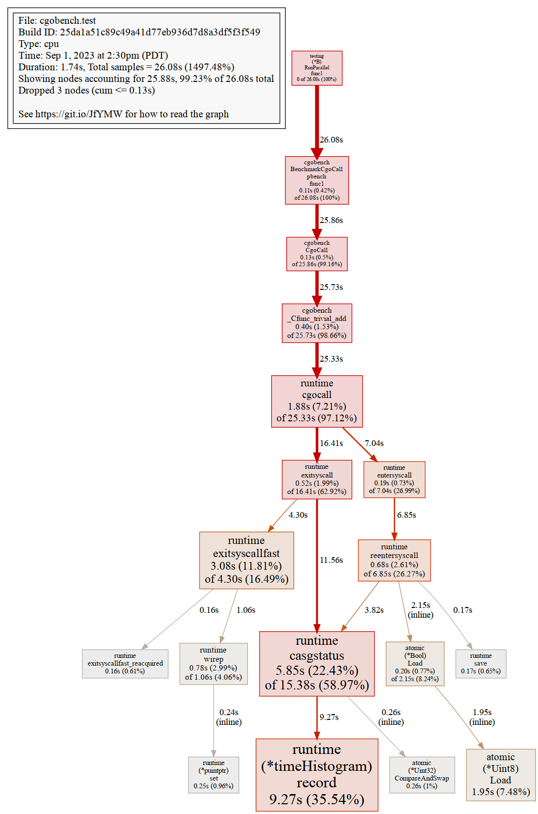
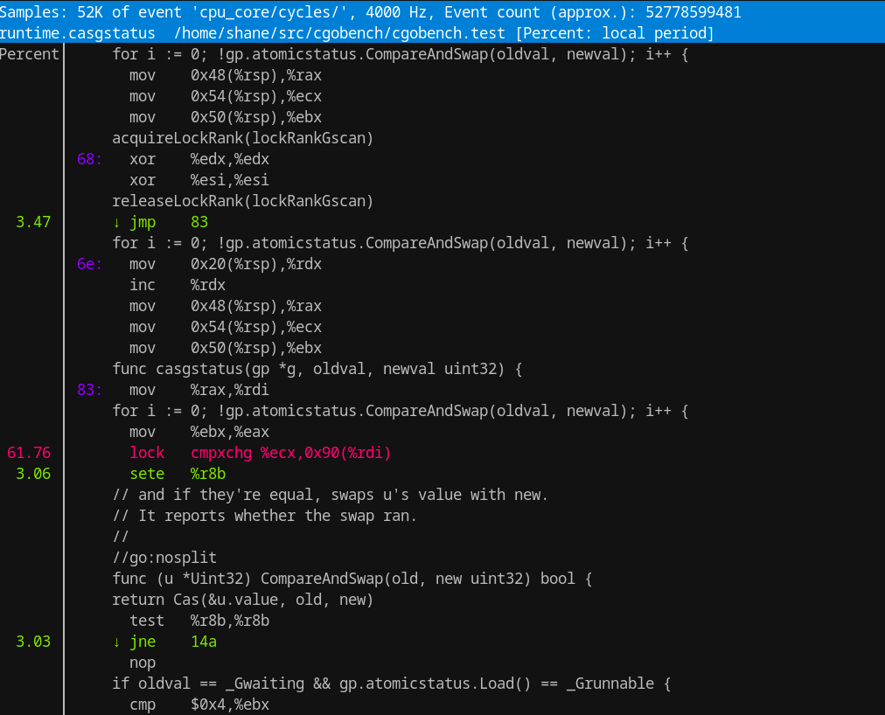

# CGO在Go 1.21中的表现

[blog](https://shane.ai/posts/cgo-performance-in-go1.21/)

CGO Performance In Go 1.21
CGO在Go 1.21中的表现
2023-09-01 :: [shane] 2023-09-01 ：： [谢恩]

## Tl;Dr

Cgo calls take about 40ns, about the same time encoding/json takes to parse a single digit integer. On my 20 core
machine Cgo call performance scales with core count up to about 16 cores, after which some known contention issues slow
things down.
Cgo 调用大约需要 40ns 的时间，大约需要相同的时间来 encoding/json 解析一位整数。在我的 20 核机器上，Cgo 调用性能可扩展，核心数增加到大约
16 个核心，之后一些已知的争用问题会减慢速度。

## Disclaimer 免责声明

While alot of this article argues that “Cgo performance is good actually”, please don’t take that to mean “Cgo is good
actually”. I’ve maintained production applications that use Cgo and non-trivial bindings to lua. Performance was great.
Go upgrades were a regular source of toil. The drawback to using Cgo is losing Go cross compilation benefits and having
to manage c dependencies. These days I mainly use Cgo for compatibility and to access libraries that happen to be
written in C/C++.
虽然这篇文章的很多内容都认为“Cgo的表现实际上很好”，但请不要认为这意味着“Cgo实际上很好”。我维护了使用 Cgo 和 lua
的非平凡绑定的生产应用程序。性能很棒。Go 升级是辛劳的常规来源。使用 Cgo 的缺点是失去了 Go 交叉编译的好处，并且必须管理 c
依赖项。这些天我主要使用 Cgo 来实现兼容性和访问碰巧用 C/C++ 编写的库。

## Cgo & performance

Cgo performance is poorly understood in Go, and searching for information online mixes content from 2 years ago with
content from 7 years ago. Cockroach labs wrote a great article that measured performance and touched on the complexities
of using Cgo. Since then Go performance has improved quite a bit, but everything else they said is relevant. My similar
benchmarks are 17x faster than what Cockroach labs saw in 2015. Some of that might be hardware by suspect most of it is
just improvements to Go. Unfortunately I see a lot of Go programmers have internalized that “Cgo is slow” without really
knowing what it’s slow compared to. Cgo is slow compared to a regular function call. It’s certainly not slow compared to
doing any sort of I/O or parsing work.
在 Go 中对 Cgo 的性能知之甚少，在线搜索信息将 2 年前的内容与 7 年前的内容混合在一起。蟑螂实验室写了一篇很棒的文章，测量了性能，并谈到了使用Cgo的复杂性。从那以后，Go
性能有了很大的提高，但他们所说的其他一切都是相关的。我的类似基准测试比蟑螂实验室在 2015 年看到的快 17
倍。其中一些可能是硬件，其中大部分只是对Go的改进。不幸的是，我看到很多 Go 程序员已经内化了“Cgo 很慢”，却不知道它与什么相比慢。与常规函数调用相比，Cgo
速度较慢。与执行任何类型的I / O或解析工作相比，它当然不慢。

In this post I want to build on the idea of “latency numbers every programmer should know” to figure out where in the
context of “slow” Cgo lands in the hierarchy of L1 cache reference -> mutex lock -> main memory reference -> sending a
packet on the network. These numbers are from 2012, so they are really just here to give us a sense of scale:
在这篇文章中，我想以“每个程序员都应该知道的延迟数字”的想法为基础，找出在“慢速” Cgo 的上下文中，在 L1 缓存引用 - >互斥锁 - >
主内存引用 - >在网络上发送数据包的层次结构中的位置。这些数字来自2012年，所以它们实际上只是为了给我们一种规模感：

## latency comparison numbers  延迟比较数字

| 项目                                                               | 延迟                                  |
|------------------------------------------------------------------|-------------------------------------|
| L1 cache reference 一级缓存参考                                        | 0.5 ns 0.5 纳秒                       |
| Branch mispredict 分支错误预测                                         | 5 ns 5 纳秒                           |
| L2 cache reference 二级缓存参考                                        | 7 ns 7 纳秒                           |
| Mutex lock/unlock 互斥锁/解锁                                         | 25 ns 25 纳秒                         |
| Main memory reference 主存储器参考                                     | 100 ns 100 纳秒                       |
| Compress 1K bytes with Zippy 使用 Zippy 压缩 1K 字节                   | 3,000 ns 3 us 3,000 纳秒 3 微秒         |
| Send 1K bytes over 1 Gbps network 通过 1 Gbps 网络发送 1K 字节	10,000 ns | 10 us 10,000 纳秒 10 微秒               |
| Read 4K randomly from SSD* 从固态硬盘随机读取 4K*                         | 150,000 ns 150 us 150,000 纳秒 150 微秒 |
| Read 1 MB sequentially from memory 从内存中按顺序读取 1 MB                | 250,000 ns 250 us 250,000 纳秒 250 微秒 |
| Round trip within same datacenter 同一数据中心内的往返                     | 500,000 ns 500 us 500,000 纳秒 500 微秒 |

My thesis is: Cgo is having overhead, but it doesn’t have as much overhead as it used to and it may not have as much
overhead as you think.
我的论点是：Cgo有开销，但它没有以前那么多开销，也可能没有你想象的那么多开销。

Let's talk about what Cgo is and a teeny bit about how it works. Cgo is essentially Go’s ffi. When you use Cgo you can
call C functions from Go and pass information back and forth (subject to some rules). The Go compiler auto-generates
some
functions to bridge between the Go & C and handle things like differences in platform calling conventions. There are
also mismatches in how blocking calls are handled and how stack is allocated that make it impractical/unsafe to run Go
and C code on the same stack. I won’t go too much into the implementation but at a high level “Cgo means IPC between
threads” is a good mental model.
让我们谈谈Cgo是什么，以及它是如何工作的。Cgo本质上是Go的ffi。当你使用 Cgo 时，你可以从 Go 调用 C 函数并来回传递信息（受某些规则的约束）。Go
编译器自动生成一些函数来桥接 Go 和 C 并处理平台调用约定的差异等事情。在如何处理阻塞调用以及如何分配堆栈方面也存在不匹配，这使得在同一堆栈上运行
Go 和 C 代码变得不切实际/不安全。我不会过多地介绍实现，但在高层次上“Cgo 意味着线程之间的 IPC”是一个很好的心智模型。

## Benchmarking 基准测试

Let's write some benchmarks to explore performance . You can follow along
at [shanemhansen/cgobench](github.com/shanemhansen/cgobench). The code in the repo is autogenerated from
the [source org](https://github.com/shanemhansen/shane.ai/blob/main/docs/content-org/all-posts.org)
file for this article using an implementation of Knuth’s literate programming. Is it the most productive way to write
articles? Probably not, but it’s fun and frankly playing around with new workflows helps my ADHD brain focus. But I
digress.
让我们写一些基准来探索性能。您可以在 [shanemhansen/cgobench](github.com/shanemhansen/cgobench) 关注。存储库中的代码是使用
Knuth 的文字编程实现从本文的源组织文件自动生成的。这是写文章最有成效的方式吗？可能不是，但这很有趣，坦率地说，玩弄新的工作流程有助于我的多动症大脑集中注意力。但我离题了。

First off we’ll put a no-op go function in bench.go and do a parallel benchmark. It doesn’t do anything which is a great
place to start.
首先，我们将放入一个无操作 go 函数 bench.go 并执行并行基准测试。它不做任何事情，这是一个很好的起点。

bench.go

```go
func Call() {
	// do less
}
```

Now we’ll add a simple parallel benchmark helper along with our empty call benchmark. I’m going to start out with
something so simple the compiler can inline and then compare that to a non-inlined call. When comparing Go vs Cgo it’s
important to realize that the Go compiler can’t inline Cgo functions.
现在，我们将添加一个简单的并行基准测试帮助程序以及空调用基准测试。我将从编译器可以内联的简单内容开始，然后将其与非内联调用进行比较。在比较
Go 与 Cgo 时，重要的是要意识到 Go 编译器不能内联 Cgo 函数。

bench_test.go

```go
// helper to cut down on boilerplate
func pbench(b *testing.B, f func()) {
	b.RunParallel(func(pb *testing.PB) {
		for pb.Next() {
			f()
		}
	})

}
// Same as above, but explicitly calling the inlineable Call func.
func BenchmarkEmptyCallInlineable(b *testing.B) {
	b.RunParallel(func(pb *testing.PB) {
		for pb.Next() {
			Call()
		}
	})
}
func BenchmarkEmptyCall(b *testing.B) {
	pbench(b, Call)
}
```

In the case of benchmarking no-ops it’s always good to check and make sure your code didn’t get completely optimized
away. I tend to just look at the disassembled output in BenchmarkEmptyCall and sure enough I see a convincing call *%rax
instruction in the assembly. A non dynamic dispatch version would look like: call foo+0x3 but this version is calling a
function who’s address is in the rax register.
在对无操作进行基准测试的情况下，检查并确保您的代码没有完全优化总是好的。我倾向于只查看反汇编的输出 BenchmarkEmptyCall
，果然我在程序集中看到了一个令人 call *%rax 信服的指令。非动态调度版本如下所示： call foo+0x3 但是这个版本正在调用一个地址在
rax 寄存器中的函数。

Let’s compile and examine:
让我们编译并检查：

```sh
$ go test -c
$ objdump -S cgobench.test  | grep -A15 '^0.*/cgobench.BenchmarkEmptyCall.pbench.func'
0000000000522920 <github.com/shanemhansen/cgobench.BenchmarkEmptyCall.pbench.func1>:
b.RunParallel(func(pb *testing.PB) {
522920:	49 3b 66 10          	cmp    0x10(%r14),%rsp
522924:	76 36                	jbe    52295c <github.com/shanemhansen/cgobench.BenchmarkEmptyCall.pbench.func1+0x3c>
522926:	55                   	push   %rbp
522927:	48 89 e5             	mov    %rsp,%rbp
52292a:	48 83 ec 18          	sub    $0x18,%rsp
52292e:	48 89 44 24 10       	mov    %rax,0x10(%rsp)
522933:	48 8b 4a 08          	mov    0x8(%rdx),%rcx
522937:	48 89 4c 24 08       	mov    %rcx,0x8(%rsp)
for pb.Next() {
52293c:	eb 0f                	jmp    52294d <github.com/shanemhansen/cgobench.BenchmarkEmptyCall.pbench.func1+0x2d>
f()
52293e:	48 8b 54 24 08       	mov    0x8(%rsp),%rdx
522943:	48 8b 02             	mov    (%rdx),%rax
522946:	ff d0                	call   *%rax
```

Now that we’ve verified our benchmark we can run it. I’m going to run benchmarks with a few different coure count values
so we can see how the output changes. While writing this post I experimented with some other values and for most
benchmarks performance increased linearly with core count up to 16 before it began falling off. On my machine with 20
cores the overhead of the dynamic call is around 1ns and the inlinable version is significantly faster. As expected.
现在我们已经验证了我们的基准测试，我们可以运行它了。我将使用几个不同的库尔计数值运行基准测试，以便我们可以看到输出如何变化。在写这篇文章时，我尝试了一些其他值，对于大多数基准测试，性能呈线性增长，核心数在开始下降之前达到
16。在我的 20 个内核的机器上，动态调用的开销约为 1ns，而内联版本明显更快。不出所料。

```sh
$ go test -cpu=1,2,4,8,16  -bench EmptyCall
goos: linux
goarch: amd64
pkg: github.com/shanemhansen/cgobench
cpu: 12th Gen Intel(R) Core(TM) i7-12700H
BenchmarkEmptyCallInlineable       	1000000000	         0.2784 ns/op
BenchmarkEmptyCallInlineable-2     	1000000000	         0.1383 ns/op
BenchmarkEmptyCallInlineable-4     	1000000000	         0.07377 ns/op
BenchmarkEmptyCallInlineable-8     	1000000000	         0.04089 ns/op
BenchmarkEmptyCallInlineable-16    	1000000000	         0.02481 ns/op
BenchmarkEmptyCall                 	718694536	         1.665 ns/op
BenchmarkEmptyCall-2               	1000000000	         0.8346 ns/op
BenchmarkEmptyCall-4               	1000000000	         0.4443 ns/op
BenchmarkEmptyCall-8               	1000000000	         0.2385 ns/op
BenchmarkEmptyCall-16              	1000000000	         0.1399 ns/op
PASS
ok  	github.com/shanemhansen/cgobench	3.819s
```

So now I can think of “go function call” cost as “a little more expensive than a L1 cache reference” in the above table.
What happens if we add a Cgo call?
所以现在我可以将“go 函数调用”成本视为上表中的“比 L1 缓存引用贵一点”。如果我们添加 Cgo 调用会发生什么？

Below is a trivial c function to add 2 integers and a go function to call it. Note that although we might expect gcc to
inline trivial_add, we don’t expect Go’s compiler to. I did play with some even simpler C functions but they didn’t
really perform better.
下面是一个简单的 c 函数，用于添加 2 个整数和一个 go 函数来调用它。请注意，虽然我们可能期望 gcc 内联trivial_add，但我们不希望
Go 的编译器这样做。我确实玩过一些更简单的C函数，但它们并没有真正表现得更好。

bench.go

```go
int trivial_add(int a, int b) {
  return a+b;
}

// wow this is easy
// import "C"
func CgoCall() {
	C.trivial_add(1,2)
}
```

bench_test.go

```go
func BenchmarkCgoCall(b *testing.B) {
	pbench(b, CgoCall)
}
```

We run benchmarks in the usual way. Single threaded Cgo overhead is about 40ns. Performance seems to scale linearly with
the number of cores up to 16ish so if I had a Cgo-bound workload I might not bother putting it on a machine with 32
core, but real workloads usually involve more than just calling a cgo func. We can see:
我们以通常的方式运行基准测试。单线程Cgo开销约为40ns。性能似乎随着内核数量达到 16 个左右而线性扩展，因此如果我有一个 Cgo
绑定的工作负载，我可能不会费心将其放在具有 32 个内核的机器上，但实际工作负载通常不仅仅涉及调用 cgo func。我们可以看到：

Cgo has 40ns overhead. That sits somewhere between “mutex lock” and “main memory reference”.
Cgo的开销为40ns。它介于“互斥锁”和“主内存引用”之间。
40ns/op is 25 million ops/s. That’s pretty good for most projects I’ve worked on. At 4ns/op and 16 cores we’re getting
250 million ops/s.
40ns/op 是 2500 万次操作/秒。这对于我参与过的大多数项目来说都非常好。在 4ns/op 和 16 个内核下，我们获得了 2.5 亿次操作/秒。

```sh
$ go test -cpu=1,2,4,8,16,32  -bench Cgo
goos: linux
goarch: amd64
pkg: github.com/shanemhansen/cgobench
cpu: 12th Gen Intel(R) Core(TM) i7-12700H
BenchmarkCgoCall       	28711474	        38.93 ns/op
BenchmarkCgoCall-2     	60680826	        20.30 ns/op
BenchmarkCgoCall-4     	100000000	        10.46 ns/op
BenchmarkCgoCall-8     	198091461	         6.134 ns/op
BenchmarkCgoCall-16    	248427465	         4.949 ns/op
BenchmarkCgoCall-32    	256506208	         4.328 ns/op
PASS
ok  	github.com/shanemhansen/cgobench	8.609s
```

Now I want to understand a little bit more about why performance is that way. We’ll use Go’s great profiling tools to
get a better picture of performance at higher core counts. I’m a fan of the pprof web view, which tells us that
runtime.(*timeHistorgram).record and runtime.casgstatus are taking lots of time. This tracks with Ian Lance Taylor’s
observations. Interestingly he doesn’t expect these operations to be contended, so there’s potential for improving
performance.
现在我想更多地了解为什么性能会这样。我们将使用 Go 出色的分析工具，以更高的内核数更好地了解性能。我是 pprof 网络视图的粉丝，它告诉我们这一点
runtime.(*timeHistorgram).record ，并且 runtime.casgstatus 花费了很多时间。这与伊恩·兰斯·泰勒（Ian Lance
Taylor）的[观察结果](https://groups.google.com/g/golang-dev/c/XSkrp1_FdiU?pli=1)一致。有趣的是，他并不认为这些操作会受到竞争，因此有可能提高性能。

Running the test and collecting results:
运行测试并收集结果：

```sh
go test -c
./cgobench.test  -test.cpuprofile=c.out -test.cpu=16 -test.bench Cgo
go tool pprof -png cgobench.test c.out > cpu.png
goos: linux
goarch: amd64
pkg: github.com/shanemhansen/cgobench
cpu: 12th Gen Intel(R) Core(TM) i7-12700H
BenchmarkCgoCall-16    	235322289	         4.955 ns/op
PASS
```

Note the 2 large boxes near the bottom:
请注意底部附近的 2 个大框：



I also use linux `perf`. It does a good job of being able to profile cross language stuff for compiled languages as well
as combining both userspace and kernel performance info. A quick snapshot of (one of) the hot instructions in question
in question from perf:
我也使用 Linux `perf` 。它能够很好地分析编译语言的跨语言内容，以及结合用户空间和内核性能信息。来自 perf
的有问题的热指令的（其中一个）的快速快照：



Before we put it all together I’ll add one final piece of data in to help us get perspective. Here’s a carefully crafted
JSON decoding benchmark that just parses an integer. It’s written using json.NewDecoder because just json.Unmarshal
allocates too much. What you’ll see below is that a Cgo call is 20% cheaper than a trivial JSON parse using the standard
library in both single threaded and parallel tests.
在我们把它们放在一起之前，我将添加最后一条数据来帮助我们获得视角。这是一个精心设计的 JSON 解码基准，它只解析一个整数。它是用
json.NewDecoder 的，因为分配 json.Unmarshal 太多了。您将在下面看到的是，在单线程和并行测试中使用标准库的普通 JSON 解析比普通
JSON 解析便宜 20%。

bench_test.go

```go
func BenchmarkJSONCall(b *testing.B) {
	msg := `1`
	b.RunParallel(func(pb *testing.PB) {
		var dst int
		r := strings.NewReader(msg)
		dec := json.NewDecoder(r)
		for pb.Next() {
			r.Seek(0, io.SeekStart)
			if err := dec.Decode(&dst); err != nil {
				panic(err)
			}
		}
	})
}
```

```sh
go test -cpu=1,16 -bench JSON
goos: linux
goarch: amd64
pkg: github.com/shanemhansen/cgobench
cpu: 12th Gen Intel(R) Core(TM) i7-12700H
BenchmarkJSONCall       	21399691	        52.79 ns/op
BenchmarkJSONCall-16    	217874599	         5.471 ns/op
PASS
ok  	github.com/shanemhansen/cgobench	2.942s
```

## Conclusions 结论

So at this point we’ve measured performance overhead of Cgo, at least in terms of wall clock time (note that we haven’t
looked at memory/thread count/battery usage/etc). We know that the overhead is on the order of 2 mutex operations and
that it does scale with number of cores up to around 16. We’ve also seen that with 16 cores we can do around 4ns/op or
close to 250 million Cgo ops/s. So if I was looking at using Cgo in 2023 I’d definitely use it outside of very hot
loops. There’s many reasons I wouldn’t use Cgo in 2023 (see disclaimer), but performance is unlikely to be one of them.
因此，在这一点上，我们已经测量了Cgo的性能开销，至少在挂钟时间方面（请注意，我们还没有查看内存/线程数/电池使用情况等）。我们知道开销大约是
2 个互斥操作，并且它确实随着内核数量扩展到 16 个左右而扩展。我们还看到，使用 16 个内核，我们可以完成大约 4ns/op 或接近 2.5 亿
Cgo ops/s。因此，如果我考虑在 2023 年使用 Cgo，我肯定会在非常热的循环之外使用它。我不会在 2023 年使用 Cgo
的原因有很多（见免责声明），但性能不太可能是其中之一。

I’ll end with this little Cgo version of “latency numbers every programmer should know” table:
我将以这个小 Cgo 版本的“每个程序员都应该知道的延迟数字”表结束：

Go/Cgo latency Go/Cgo 延迟:

| Benchmark Name 基准名称      | 1 core 1 核        | 16 cores 16 核         |
|--------------------------|-------------------|-----------------------|
| Inlined Empty func 内联空函数 | 0.271 ns 0.271 纳秒 | 0.02489 ns 0.02489 纳秒 |
| Empty func 空函数           | 1.5s ns 1.5秒纳秒    | 0.135 ns 0.135 纳秒     |
| cgo                      | 40 ns             | 4.281 ns              |
| encoding/json int parse  | 52.89 ns 52.89 纳秒 | 5.518 ns 5.518 纳秒     |
