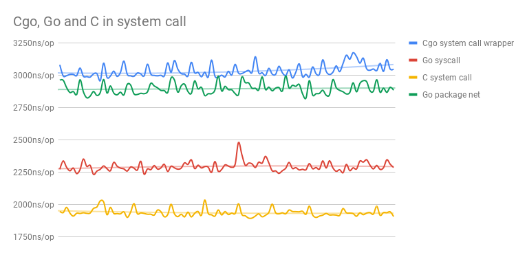

# Benchmark: CGO vs GO vs C in System Calls `read/write`

## Run

```bash
sh run.sh
```

## Results



see [data](https://docs.google.com/spreadsheets/d/18569Kd2Xr382xiBZqMEsfHzgK4DDtxt4UsbdhTO4v7Q).

```sh
🕙[2021-11-10 23:19:00.736] ❯ ./run.sh   
goos: darwin
goarch: amd64
pkg: github.com/bingoohuang/cgo-bench/syscall
cpu: Intel(R) Core(TM) i7-8850H CPU @ 2.60GHz
BenchmarkReadWriteCgoCalls
BenchmarkReadWriteCgoCalls-12             678487              1599 ns/op
BenchmarkReadWriteCgoCalls-12             742852              1609 ns/op
BenchmarkReadWriteCgoCalls-12             768133              1622 ns/op
BenchmarkReadWriteCgoCalls-12             759739              1576 ns/op
BenchmarkReadWriteCgoCalls-12             749510              1619 ns/op
BenchmarkReadWriteGoCalls
BenchmarkReadWriteGoCalls-12              849690              1426 ns/op
BenchmarkReadWriteGoCalls-12              836304              1404 ns/op
BenchmarkReadWriteGoCalls-12              841615              1403 ns/op
BenchmarkReadWriteGoCalls-12              848751              1395 ns/op
BenchmarkReadWriteGoCalls-12              801244              1422 ns/op
BenchmarkReadWriteNetCalls
BenchmarkReadWriteNetCalls-12             681048              1751 ns/op
BenchmarkReadWriteNetCalls-12             663421              1805 ns/op
BenchmarkReadWriteNetCalls-12             662114              1836 ns/op
BenchmarkReadWriteNetCalls-12             656422              1857 ns/op
BenchmarkReadWriteNetCalls-12             649724              1846 ns/op
PASS
ok      github.com/bingoohuang/cgo-bench/syscall        21.779s
BenchmarkReadWritePureCCalls    500000  1132 ns/op
BenchmarkReadWritePureCCalls    500000  1168 ns/op
BenchmarkReadWritePureCCalls    500000  1160 ns/op
BenchmarkReadWritePureCCalls    500000  1166 ns/op
BenchmarkReadWritePureCCalls    500000  1152 ns/op

Downloads/cgo-bench/syscall via 🐹 v1.17.3 via C base took 26s
```

## Conclusions

- Pure Go system call is `(3532 - 2599) / 2599 = 35.90%` faster than Cgo call.
- Pure C system call is `(2599 - 2244) / 2244 = 15.82%` faster than Go system call.
- Pure C system call is `(3532 - 2244) / 2244 = 57.40%` faster than Cgo system call.

## Related researches

- https://github.com/golang/go/issues/19563
- https://github.com/golang/go/issues/19574
